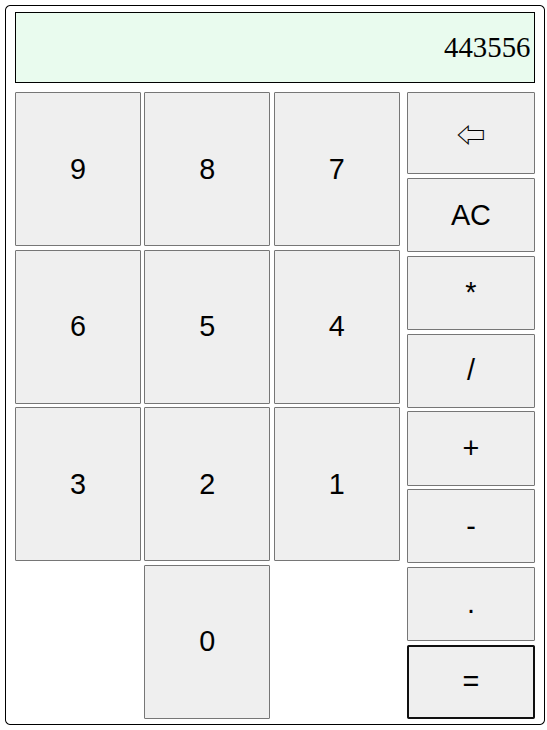

# Calculator

A browser-based calculator built with vanilla JavaScript as part of The Odin Project Foundations course.

## Description
This project focuses on implementing core calculator functionality while practicing DOM manipulation, event handling, and basic application state management - all without using external libraries.

## Features
- Basic arithmetic operations (add, subtract, multiply, divide)
- Keyboard and button input support
- Clear and reset functionality
- Error handling for invalid operations (e.g. division by zero) 

## Tech Used
- HTML
- CSS
- JavaScript

## What I Learned
- Managing application state in JavaScript
- Handling user input through events
- Updating the DOM dynamically
- Structuring logic for reusable functions
- Adding keyboard support

## How to Run
1. Clone the repository
2. Open `index.html` in your browser